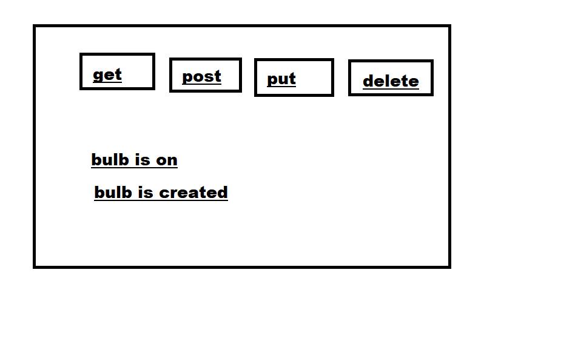

# class work: 



make a html 5 application with four buttons like you in the photo, and when button each button pressed make an http request on the server running in your instructor laptop (address: http://192.168.50.177) and write the response on screen as you see in photo above,
here is the code to make http request from html5/javascript: 
```
function Get(){
    const Http = new XMLHttpRequest();
    const url = 'http://192.168.50.177:3000/bulb';
    Http.open("GET", url);
    Http.send();

    Http.onreadystatechange = (e) => {
        console.log(Http.responseText)
    }
}
```


# Home work

make a html5 login and signup application, earlier you have created the same app with local storage, this time make it with server

make an html5 application host on github pages

make a express application host on heroku

when user fill the signup form and click on signup make http request on your server (deployed on heroku) and save the user in an array in your server and respond with the text "signup success" and display in web app screen

when user login make http request to your server(deployed on heroku) and iterate on the user array if user matches send signup success response to user otherwise send error message such as "user not exist" or "wrong password entered" etc.

note: every time you restart the server all variables are removed so user array will be removed as well, your user will stay as long as your server is running

